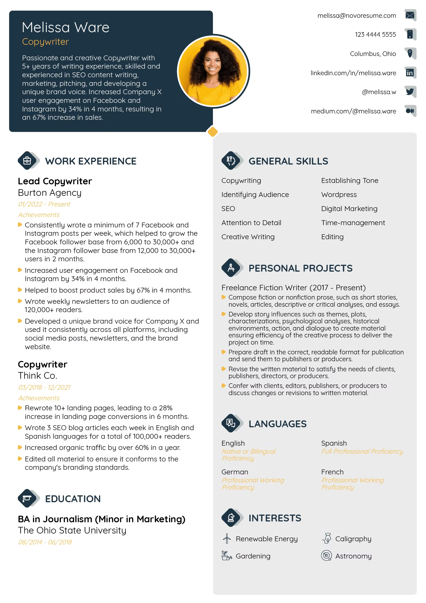

# 🤖 AI Resume Analyzer

<p align="center">
  
</p>

<p align="center">
  Analyze resumes with AI, receive personalized feedback, and improve your chances of landing interviews.
</p>

<p align="center">


</p>

---

# 🌐 Live Demo

Try the app here: [https://reume-analyzer.vercel.app/](https://reume-analyzer.vercel.app/)

---

# 📖 Overview

AI Resume Analyzer is a modern web application that helps job seekers improve their resumes using Artificial Intelligence.

Simply upload your resume, and the application analyzes different aspects of it, providing actionable suggestions to increase your chances of getting shortlisted by recruiters.

Whether you're a student, fresher, or experienced developer, this tool helps you create a stronger resume.

---

# ✨ Features

- 📄 Upload Resume (PDF)
- 🤖 AI-powered resume analysis
- 📊 Resume scoring
- 💡 Personalized improvement suggestions
- 📝 Section-wise feedback
- ⚡ Fast and responsive UI
- 🌙 Modern interface
- 📱 Mobile-friendly design
- 🔒 Secure file handling

---

# 🛠 Tech Stack

## Frontend

- React
- TypeScript
- React Router
- Vite
- Tailwind CSS

## File Upload

- React Dropzone

## Backend

- Node.js
- Puter APIs

## AI

- OpenAI-compatible AI models

## Deployment

- Vercel
- Render

---

# 📂 Project Structure

```text
AI-Resume-Analyzer
│
├── app/
│   ├── components/
│   ├── routes/
│   ├── lib/
│   └── styles/
│
├── public/
│
├── package.json
├── vite.config.ts
└── README.md
```

---

# 🖼 Screenshots

## Home Page


---

## Resume Upload



---

## Analysis Result


---

# 🚀 Getting Started

## Clone Repository

```bash
git clone https://github.com/ar2727065-bit/ai-resume-analyzer.git
```

## Navigate into Project

```bash
cd ai-resume-analyzer
```

## Install Dependencies

```bash
npm install
```

## Start Development Server

```bash
npm run dev
```

Open

```text
http://localhost:5173
```

---

# 🔑 Environment Variables

Create a `.env` file in the project root.

```env
PUTER_API_KEY=your_api_key
```

---

# ⚙️ How It Works

1. Upload your resume.
2. The resume is processed.
3. AI extracts important information.
4. Resume quality is analyzed.
5. Suggestions are generated.
6. Final score and recommendations are displayed.

---

# 📈 Future Improvements

- Resume ATS Score
- Multiple Resume Comparison
- AI Cover Letter Generator
- Job Recommendation System
- Resume Templates
- LinkedIn Profile Analysis
- Download Improved Resume
- Dark Mode
- Authentication
- Resume History

---

# 🤝 Contributing

Contributions are welcome!

1. Fork the repository.
2. Create a new branch.

```bash
git checkout -b feature-name
```

3. Commit your changes.

```bash
git commit -m "Add feature"
```

4. Push the branch.

```bash
git push origin feature-name
```

5. Open a Pull Request.

---

# 📋 Roadmap

- [x] Resume Upload
- [x] AI Analysis
- [ ] Authentication
- [ ] Dashboard
- [ ] Resume History
- [ ] Export Report
- [ ] AI Cover Letter

---

# 📜 License

This project is licensed under the MIT License.

---

# 👨‍💻 Author

**Abhay Verma**

🎓 Computer Science Student

💻 Full Stack Web Developer

📚 Data Structures & Algorithms Enthusiast

### Connect with me

- GitHub: https://github.com/ar2727065-bit
- LinkedIn: https://linkedin.com/in/yourusername
- Portfolio: https://yourportfolio.com

---

# ⭐ Show Your Support

If you found this project helpful,

⭐ Star this repository

🍴 Fork it

📝 Share it with others

Your support motivates me to build more open-source projects!

---

<p align="center">
Made with ❤️ using React, TypeScript, and AI.
</p>
